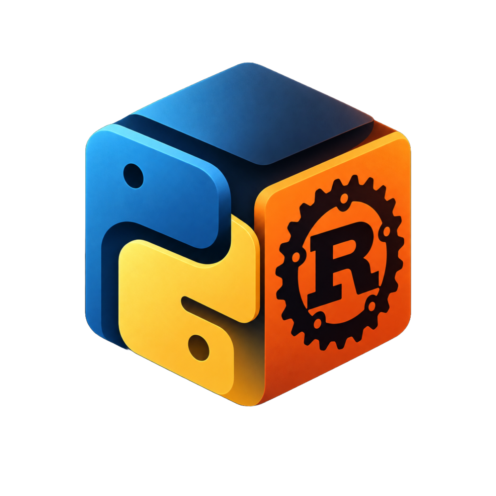
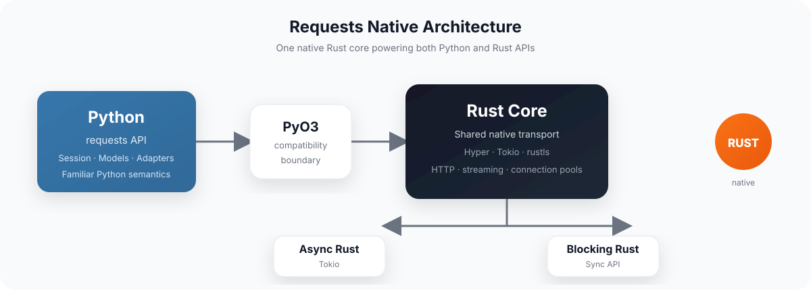

<div align="center">
  
  <h1>Requests Native</h1>
  <h3>The familiar <code>requests</code> API, backed by native Rust.</h3>
  <p>
    <!-- Release badge: current GitHub release is a prerelease (v1.0.0-beta), so shields.io reports repo not found. Restore when a stable release exists. -->
    <!--  -->
    
    
    
  </p>
  <p>
    <a href="https://github.com/puneet-chandna/requests-native/releases/tag/v1.0.0-beta">Download beta</a> ·
    <a href="https://github.com/puneet-chandna/requests-native/issues">Issues</a> ·
    <a href="PORTING.md">Architecture &amp; Porting</a> ·
    <a href="API_COMPATIBILITY.tsv">Compatibility</a>
  </p>
</div>





> **Beta software.** Requests Native is an independent Rust rewrite targeting strict compatibility with Requests **2.34.2**. The current beta has a known intermittent Windows TLS issue. Test your workload before replacing production Requests. It is not currently published to PyPI or crates.io.

---


## What is this?

Requests Native keeps the interface Python developers already know:

```python
import requests

response = requests.get("https://httpbin.org/get", timeout=10)
response.raise_for_status()

print(response.json())
```

Under the hood, the default built-in `Session` / `HTTPAdapter` path is connected to a native Rust transport through a **PyO3 boundary**.

The same Rust core also exposes separate async and blocking APIs for Rust applications.

The goal isn't to invent another HTTP client.

> **Move the implementation underneath Requests — without changing the interface developers already know.**

That means preserving observable Python behaviour, extension points, errors, ordering, streaming, and compatibility semantics while moving the transport layer into Rust.

---


## Why Rust underneath Python?

Requests Native is built around one shared transport core:


| Surface                  | What you get                                                                |
| ------------------------ | --------------------------------------------------------------------------- |
| **Python**               | Familiar `import requests` API and Requests-compatible objects              |
| **Rust async**           | Native async client built on Tokio + Hyper                                  |
| **Rust blocking**        | Native blocking client without requiring a Tokio runtime in the application |
| **Compatibility bridge** | PyO3 handles Python values, callbacks, exceptions, and extension points     |


The architecture deliberately keeps dynamic Python behaviour authoritative where compatibility requires it.

Custom adapters, subclassing, monkeypatching, arbitrary callbacks, and other dynamic cases can fall back to Python before native I/O begins.

---


## Architecture

```text
                       Python application
                              │
                              ▼
                    ┌───────────────────┐
                    │   requests API    │
                    │ Session / Models  │
                    └─────────┬─────────┘
                              │
                         PyO3 boundary
                              │
               ┌──────────────▼──────────────┐
               │          Rust Core           │
               │  shared transport + state   │
               └──────────┬─────────┬────────┘
                          │         │
                  ┌───────▼───┐ ┌──▼─────────┐
                  │ Async API │ │  Blocking  │
                  │   Tokio   │ │     API    │
                  └───────────┘ └────────────┘
```

See `[PORTING.md](PORTING.md)` for the detailed architecture and compatibility rules.

---


# Quick Start


## Python


### One-shot requests

```python
import requests

response = requests.get(
    "https://httpbin.org/get",
    params={"hello": "world"},
    timeout=10,
)

response.raise_for_status()

print(response.json())
```


### Connection reuse

```python
import requests

with requests.Session() as session:
    response = session.get(
        "https://httpbin.org/get",
        timeout=10,
    )

    response.raise_for_status()
    print(response.json())
```

The intention is simple:

```python
# Existing Requests code

import requests

requests.get("https://example.com")
```

should continue to look like Requests.

---


# Installation


## Prebuilt beta wheel

Download the wheel matching your Python version, operating system, and CPU architecture from the **[v1.0.0-beta release](https://github.com/puneet-chandna/requests-native/releases/tag/v1.0.0-beta)**.

Current wheels cover:

- Linux x86-64
- Windows x86-64
- macOS Apple Silicon

Create a fresh virtual environment:

```console
python -m venv .venv
```

Activate it:

```console
# Linux / macOS
source .venv/bin/activate

# Windows PowerShell
.venv\Scripts\Activate.ps1
```

Then install the downloaded wheel:

```console
python -m pip install /path/to/requests_native-*.whl
```

> **Important:** Do **not** install upstream `requests` in the same environment. Both distributions provide the `requests` import package and can overwrite one another's files.

Full installation documentation is available in `[docs/user/install.rst](docs/user/install.rst)`.

---


## Build from source

Requirements:

- Python **3.10+**
- Rust via `rustup`
- A native C/C++ build toolchain
- MSVC Build Tools on Windows
- The repository-pinned Rust toolchain

```console
git clone https://github.com/puneet-chandna/requests-native.git
cd requests-native

python -m venv .venv
```

Activate the environment:

```console
# Linux / macOS
source .venv/bin/activate

# Windows PowerShell
.venv\Scripts\Activate.ps1
```

Then:

```console
python -m pip install .
```

Verify the installation:

```console
python -c "import requests; from importlib.metadata import version; print(version('requests-native'), requests.__version__, requests.__file__)"
```

The source build currently reports:

```text
requests-native : 1.0.0b1
requests        : 2.34.2
```

The Python distribution version and Requests compatibility version are intentionally separate.

---


# Rust

Requests Native also exposes its native Rust API directly.

## Add the crate

The crate is currently consumed as a local path dependency:

```toml
[dependencies]
requests-native = { path = "../requests-native/crates/requests" }
tokio = { version = "1", features = ["macros", "rt-multi-thread"] }
```

The Cargo package is:

```text
requests-native
```

and the Rust library is:

```text
requests_native
```

It is currently **not published to crates.io**.

---


## Async

```rust
use requests_native::Client;

#[tokio::main]
async fn main() -> Result<(), Box<dyn std::error::Error>> {
    let client = Client::new()?;

    let response = client
        .get("https://httpbin.org/get")
        .send()
        .await?;

    println!("{}", response.status());
    println!("{}", response.text().await?);

    Ok(())
}
```

---


## Blocking

```rust
use requests_native::blocking::Client;

fn main() -> Result<(), Box<dyn std::error::Error>> {
    let client = Client::new()?;

    let response = client
        .get("https://httpbin.org/get")
        .send()?;

    println!("{}", response.status());
    println!("{}", response.text()?);

    Ok(())
}
```

Keep clients around when possible so their connection pools can be reused.

---


# Compatibility First

Requests Native is being built with a **behaviour-first** approach.

The Python Requests implementation isn't treated as a loose specification. Observable behaviour is the specification.

That includes details such as:

- request preparation order
- mutation timing
- redirect behaviour
- authentication resend behaviour
- adapter-prefix selection
- streaming semantics
- response-body lifetime
- exception inheritance
- exception identity
- callback ordering
- insertion order
- case-insensitive mappings
- dynamic Python protocols
- custom adapters and extension points

The compatibility surface is tracked in `[API_COMPATIBILITY.tsv](API_COMPATIBILITY.tsv)`.

Ownership and lifetime decisions are documented as part of the porting process rather than being left implicit in the Rust implementation.

---


## Native vs Python fallback


### Native by default

Unmodified built-in:

```text
Session
   │
   ▼
HTTPAdapter
   │
   ▼
Rust transport
```

uses the native Rust backend by default.

### Python remains authoritative when necessary

Dynamic behaviour such as:

- custom adapters
- subclassing
- monkeypatching
- arbitrary callbacks
- Python-owned streaming objects
- unsupported extension protocols

can remain on the Python side.

This is intentional.

Requests Native is **not** claiming that every Python code path has been rewritten in Rust.

The goal is:

> **Maximum native execution without sacrificing observable Requests compatibility.**

---


# Beta Status

Requests Native is currently **beta software**.

The `v1.0.0-beta` release contains:

- **23 platform wheels**
- a source distribution
- an exact-commit validation manifest
- compatibility validation across the supported platform matrix


### Known issue

[Issue #1 — intermittent Windows TLS failures](https://github.com/puneet-chandna/requests-native/issues/1) remains open.

Some Windows HTTPS scenarios can experience connection or timeout failures, including during redirects.

The shared cause, failure rate, and production impact are not yet established.

This is a disclosed beta qualification — **not** a claim of complete Requests parity.

If you're testing the project, please test your actual workload before considering it a production replacement.

---


# Performance

A controlled Linux loopback benchmark run on **September 13, 2026** produced the following median throughput:


| Surface                       | Median requests/s |
| ----------------------------- | ----------------- |
| Frozen Python Requests oracle | **504.905**       |
| Rust-backed Python API        | **23.859**        |
| Native Rust async API         | **3,172.514**     |
| Native Rust blocking API      | **2,531.828**     |


The native Rust APIs were substantially faster in this particular run.

The Rust-backed Python API was slower than the frozen Python Requests oracle.

These measurements are **not** production workload claims.

The benchmark covers:

- one-shot and pooled clients
- buffered and streaming reads
- multiple body sizes
- serial requests
- concurrent requests

See `[benchmarks/README.md](benchmarks/README.md)` for methodology and `[benchmarks/results/20260913-local-default.json](benchmarks/results/20260913-local-default.json)` for the raw result.

> Performance is evidence, not the project's primary success criterion.
>
> A faster HTTP client that subtly changes Requests behaviour isn't a successful replacement.

---


# Project Structure

```text
requests-native/
│
├── src/requests/
│   └── Python compatibility façade
│
├── crates/
│   ├── requests/
│   │   └── Shared native Rust core
│   │
│   └── requests-python/
│       └── PyO3 compatibility boundary
│
├── tests/
│   └── Behaviour & compatibility tests
│
├── benchmarks/
│   └── Performance methodology + results
│
├── docs/
│   └── User & API documentation
│
├── API_COMPATIBILITY.tsv
│   └── Observable API compatibility inventory
│
└── PORTING.md
    └── Architecture & porting rules
```

The workspace is intentionally split so the Rust transport core does not depend on Python, while the PyO3 crate owns the Python compatibility boundary.

---


# Version Map


| Surface                                | Version / identity                 |
| -------------------------------------- | ---------------------------------- |
| Python distribution                    | `requests-native` — `1.0.0b1`      |
| Python import / compatibility baseline | `requests` — `2.34.2`              |
| Rust package                           | `requests-native` — `1.0.0-beta.1` |
| Rust library                           | `requests_native`                  |
| GitHub milestone                       | `v1.0.0-beta`                      |


The distinction is intentional:

**Requests version** = compatibility target

**Requests Native version** = rewrite release

---


# Roadmap

The long-term goal is straightforward:

```text
        Python Requests
              │
              │ same API
              ▼
       Requests Native
              │
              ▼
        Native Rust core
              │
        ┌─────┴─────┐
        ▼           ▼
     Python       Rust
      API          API
```

The difficult part isn't sending an HTTP request.

The difficult part is preserving everything around it.

That's where the majority of the engineering effort goes.

---


# Contributing

Requests Native is an ongoing compatibility port.

Before opening a pull request, read:

- `[CONTRIBUTING.md](.github/CONTRIBUTING.md)`
- `[PORTING.md](PORTING.md)`
- `[API_COMPATIBILITY.tsv](API_COMPATIBILITY.tsv)`

For security vulnerabilities, please follow the `[SECURITY.md](.github/SECURITY.md)` policy rather than opening a public issue.

The `[CODE_OF_CONDUCT.md](.github/CODE_OF_CONDUCT.md)` applies to project spaces.

---


# Attribution

Requests Native is an **unofficial, independent** Rust rewrite of [PSF Requests](https://github.com/psf/requests).

It is not affiliated with, sponsored by, or endorsed by the upstream Requests maintainers or the Python Software Foundation.

The derivative retains Requests' Apache License 2.0, notices, history, API documentation, and original contributor record.

See:

- `[LICENSE](LICENSE)`
- `[NOTICE](NOTICE)`
- `[AUTHORS.rst](AUTHORS.rst)`
- `[HISTORY.md](HISTORY.md)`

Changes specific to this Rust rewrite are maintained by **[Puneet Chandna](https://github.com/puneet-chandna)**.

---


### Familiar API. Native core. Compatibility first.

[Releases](https://github.com/puneet-chandna/requests-native/releases) · [Issues](https://github.com/puneet-chandna/requests-native/issues) · [Porting Guide](PORTING.md)

